# 使用MQTT服务网关接入设备

本文档以MQTTX为例，介绍使用第三方软件以MQTT协议接入物联网平台。MQTTX是一款基于Eclipse Paho，使用Java语言编写的MQTT客户端工具。支持通过Topic订阅和发布消息。

## 创建协议

> 自定义消息协议创建，请参考[消息协议定义](../basics-guide/protocol-support.md)。

**例**

i. 选择 `设备接入`-->`协议管理`--> 点击`新建`按钮


ii.输入协议ID

iii. 输入型号名称

iv. 选择型号类型为 `jar`

v. 输入类名`org.jetlinks.protocol.official.JetLinksProtocolSupportProvider`

vi. 上传jar包`jetlinks-official-protocol-2.0-SNAPSHOT.jar`，  请检出[jetlinks-official-protocol](https://github.com/jetlinks/jetlinks-official-protocol)自行打包。

vii. 点击确认，完成协议新增。

### 创建完成信息展示  

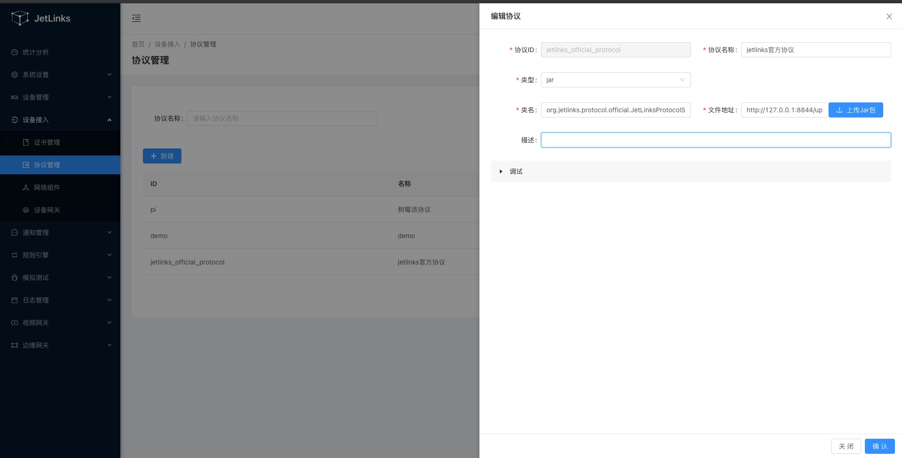

viii. 在操作列表中将协议发布。
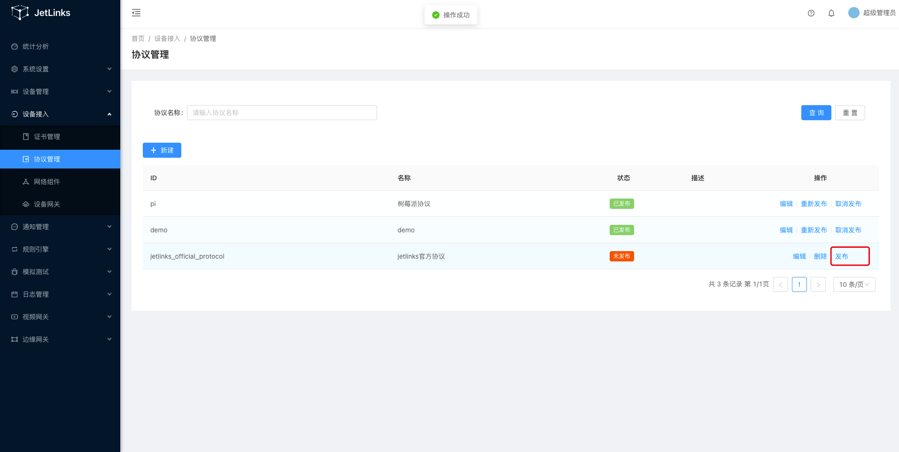
## 创建产品

**例**

i.下载型号文件[配置JSON](../basics-guide/files/device-connection/设备型号-智能温控.json)

ii. 选择 `设备管理`-->`产品`--> 点击`导入配置`按钮


iii. 选择[配置JSON](../basics-guide/files/device-connection/设备型号-智能温控.json)文件

::: tip 注意：
上传文件需要将standalone/src/main/resources/application.yml中的static-location修改为  
http://后台服务ip:8848/upload，参考[协议上传问题](../common-problems/install.md#协议发布失败或出现不支持的协议：xxx)
:::

iv.产品导入完成后，产品状态为`未发布`,效果如下图

  

 v.点击刚导入产品中的`...`按钮会出现`发布`按钮，点击`发布`按钮完成产品发布，导航栏中发布状态变为`已发布`代表发布成功。  


### 创建成功的产品信息展示 

i. 点击产品中`编辑`链接查看和编辑产品的基本信息
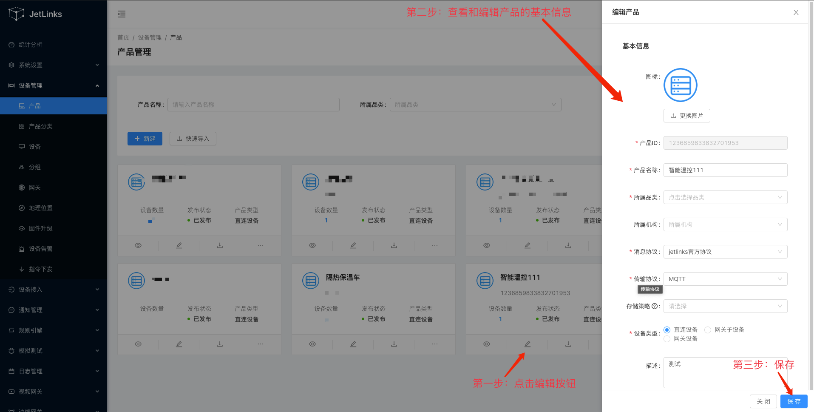

ii. 点击产品中`查看`→`物模型`,对产品设备定义


iii. 点击属性定义信、事件定义对应操作下的编辑按钮查看更详细的型号息  

属性定义参数：  
  

功能定义参数：  
  

事件定义参数：  


## 创建设备

> 自定义创建设备，请参考[添加设备](../basics-guide/device-manager.md#添加设备)。

**例**

i. 下载设备Excel文件[设备Excel](../basics-guide/files/device-connection/智能温控测试设备.xlsx)

ii. 选择 `设备管理`-->`设备`--> `其他批量操作`-->`批量导入设备`


iii. 选择需要导入的产品,点击文件上传  

  

iv. 设备导入完成效果如下图


v. 点击上图中`启用`链接完成设备激活，状态栏中发布状态变为`离线`代表设备激活成功。


### 创建成功的设备信息展示

i. 点击查看链接可以看到设备基本信息（实例信息）

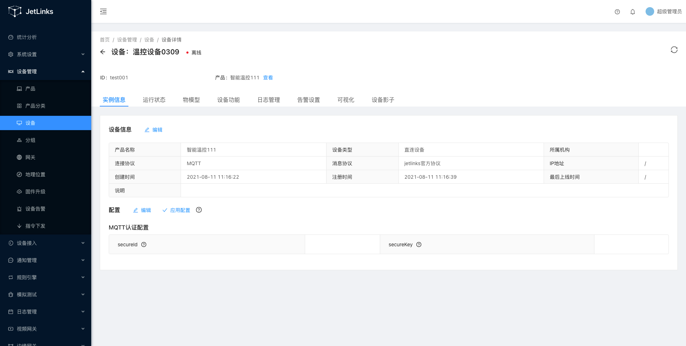

ii. 设备运行状态信息（运行状态）


iii.设备功能信息（设备功能）


iv. 设备日志（日志管理）


v.告警设置


vi.可视化


vii.设备影子


## 创建网关配置

参照[启动设备网关服务](../basics-guide/course/device-gateway.md)

**例**
i.创建MQTT服务网络组件以及MQTT服务组件配置 

::: tip 注意：
此处使用的端口为1889，docker启动时没有默认开启，使用docker启动jetlinks时请映射1889端口或者使用1883端口。  
:::
ii.启动MQTT服务组件（灰色为未启动，蓝色为启动）


iii.创建MQTT服务设备网关以及MQTT服务设备网关配置  


::: warning 警告
大部分情况，请勿勾选`认证协议`,认证协议的作用是: 使用指定的协议来进行统一的认证。不勾选时，则使用产品里选择的协议来进行认证，
这2种认证方式在协议包内的实现方式是不同的。大部分情况下不需要选择。
:::

iv.启动MQTT服务设备网关，点击 `启动`，`状态`变为`已启动`


::: tip 注意：
大部分情况无需选择认证协议. 
:::
## 使用MQTTX接入

1.下载并安装MQTTX软件。请访问[MQTTX官网](https://mqttx.app/zh)。

2.打开MQTTX软件，点击`New Connection`创建一个连接。

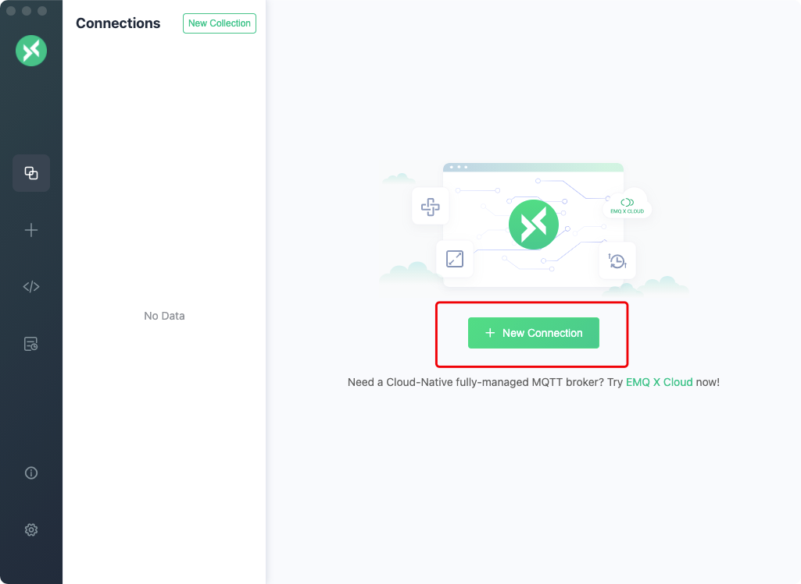

3.设置连接参数。

::: tip 注意
设置参数时，请确保参数值中或参数值的前后均没有空格。
:::

i. 设置基本信息

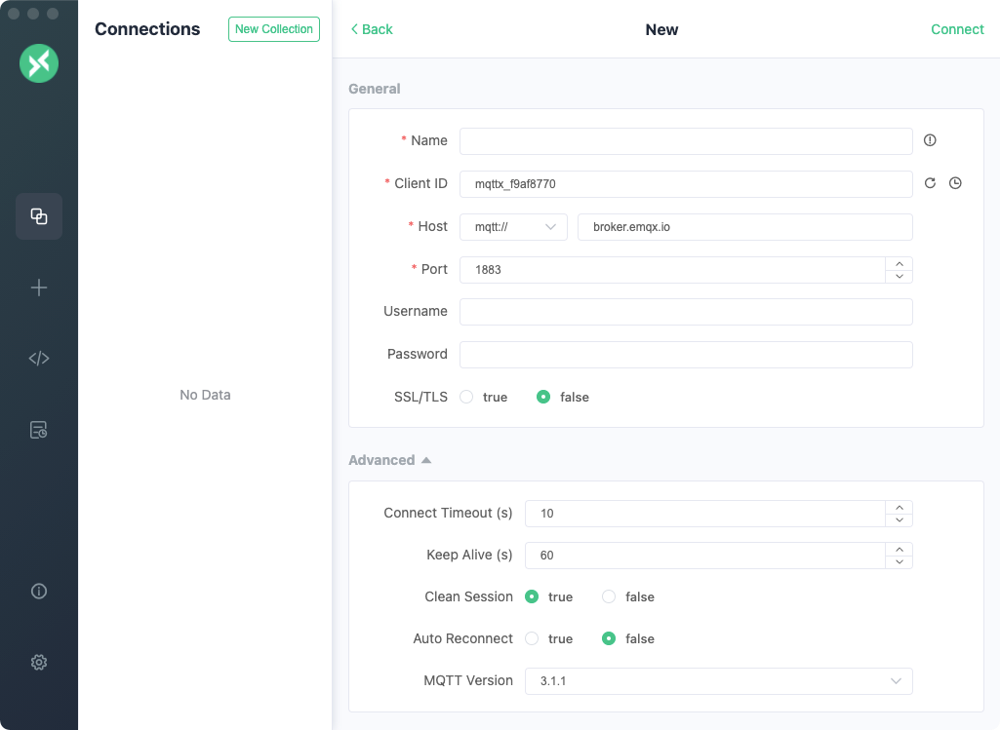

| 参数         | 说明    |
| :-----   | :-----  |
|  Name       | 输入您的自定义名称。   |
| Client ID        |    设备Id。本文档中为演示设备`test001`   |
| Host       |    连接域名。本地连接可直接填写 `127.0.0.1`,如为远程连接，请填写远程连接地址   |
|  Port        |   设置为`1889`   |
| Username       |    接入账号   |
|  Password        |   接入密码  |
:::tip 提示
 username和password[自动生成器](http://doc.jetlinks.cn/basics-guide/mqtt-auth-generator.html)

:::

4.设置完成后，单击右下角的**OK**。

## 设备消息

设备连接上平台，并进行一些基本的事件收发、属性读取操作。

### 设备上下线

单击 MqttX 中`Connect`进行连接


平台中设备状态变为上线即为连接成功


点击该设备的`查看`→`日志管理`，在设备日志模块可以看到设备上线日志


单击 MqttX 中`Disconnect`断开连接

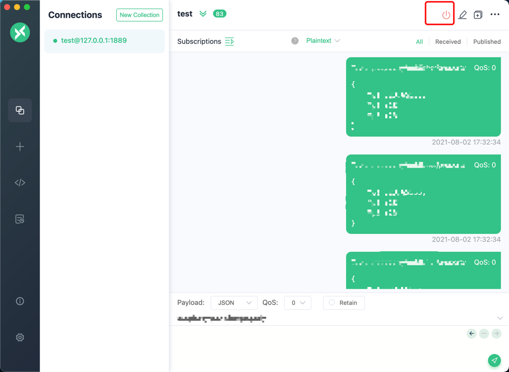

平台中设备状态变为离线即为断开连接成功


点击该设备的`查看`→`日志管理`，在设备日志模块可以看到设备离线日志


### 读取设备属性
::: tip 注意
第2步中回复平台属性值需要在第1步平台发送订阅以后的十秒钟内完成，否则平台会视为该次操作超时，导致读取属性值失败。
:::

1.平台告知设备（MQTTX）需要设备返回设备属性

单击设备页面中`test001`设备对应的`查看`链接

选择弹出框中`运行状态板块`

单击属性刷新


MQTTX会收到平台下发的订阅


::: tip 注意:
 复制好订阅该topic收到的消息中的messageId。此messageId将作为回复与平台设备属性的凭据之一
:::

2.设备（MQTTX）回复平台设备属性值

在MQTTX上发送消息，发送平台所需要的设备属性值。

i 输入一个回复平台属性值消息Topic(这里的为`/{productId}/{deviceId}/properties/read/reply`)和要发送的消息内容，
单击Publish，向平台推送该消息。


| 参数         | 说明    |
| :-----   | :-----  |
| messageId       | 平台所下发的messageId值   |
| deviceId        |   设备Id   |
| timestamp        |   当前时间戳   |
| success        |   成功标识   |
| properties        |   设备属性值对象。例如： { "temperature":"50"}   |

该文档所使用的回复内容

```json
{
 "timestamp":1601196762389,
 "messageId":"第一次平台订阅设备,MQTTX所收到的messageId值",
 "properties":{"temperature":"50"},
 "deviceId":"test001",
 "success":true
}
```

iii. 平台收到MqttX推送的属性值


iv. 读取设备属性回复的日志


#### 获取设备属性值完整演示

::: warning 注意：在下图中，从在界面上刷新属性开始直到动图结束的所有操作，需要在十秒钟内完成。否则平台会视为该次操作超时，导致读取属性值失败。
:::
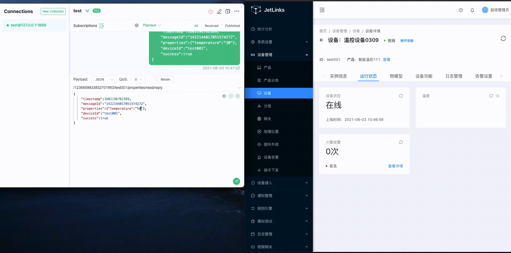

### 设备事件上报

MQTTX 推送设备事件消息到平台

以火灾报警事件为例。

1.在MQTTX上，订阅topic`/{productId}/{deviceId}/event/{eventId}`。  

2.输入事件上报Topic和要发送的事件内容，单击Publish按钮，向平台推送该事件消息。


该文档所使用的回复内容

```json
{
 "timestamp":1627960319,
 "messageId":"1422143789942595584",
 "data":{"a_name":"未来科技城",
  "b_name":"C2 栋",
  "l_name":"12-05-2012"}
}
```

| 参数         | 说明    |
| :-----   | :-----  |
| timestamp       | 毫秒时间戳   |
| messageId        |   随机消息ID   |
| data        |   上报数据，类型与物模型事件中定义的类型一致   |

3.事件上报设备日志


4.事件上报内容


### 地理位置上报

1. 物模型中添加地理位置。通过属性定义添加地理位置类型属性。
    
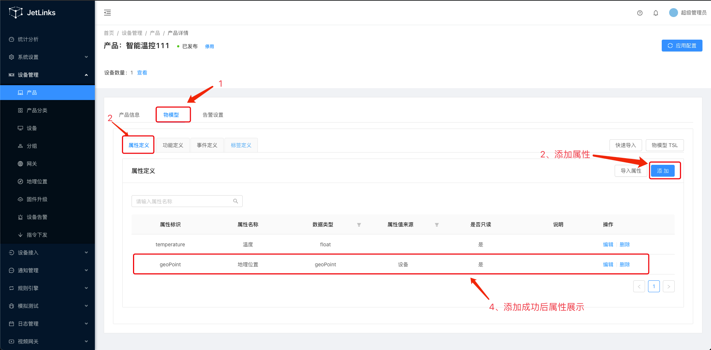  
     
2. 在设备产品详情页面点击`应用配置`按钮。  
  

3. 使用mqttX连接到平台，设备上线后推送地理位置消息到平台， 此处使用topic为`/{productId}/{deviceId}/properties/report`。  

  

此处使用的报文为：  
```json
{
 "timestamp":1601196762389,
 "messageId":"ddddd",
 "properties":{
  "geoPoint": "102.321,36.523"
 }
}
```
::: tip 注意：
上报geo地理位置类型数据有三种格式，一是字符串以逗号分隔，如：`"102.321,36.523"`;  
二是数组类型，如:`[102.321,36.523]`;  
三是map类型，如：`{"lat":102.321,"lon":36.523}`。  
:::

4. 上报成功后将在设备的运行状态中显示。  

  

也可查看上报历史消息。  

  

::: tip 注意：
物模型中的标签也可创建geo类型，但不可通过标签上报地理位置信息，只能通过属性上报。  
地理位置标签将主要运用在地图查询中。  
:::

### 调用设备功能

1. MQttX连接上平台

2.选择设备功能模块,点击执行,向设备发送topic
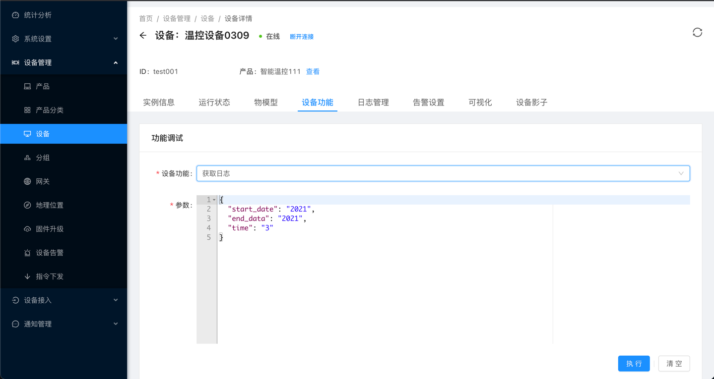  

3.在MQttX订阅topic为`/{productId}/{deviceId}/function/invoke/reply`。

此处使用的报文为：
```json
{
 "timestamp":1601196762389,
 "messageId":"1422497215780651008",
 "output":"success",
 "success":true
}
```
| 参数         | 说明    |
| :-----   | :-----  |
| timestamp       | 毫秒时间戳   |
| messageId        |    与设备下发中的messageId相同"  |
| output        |   返回执行结果,具体类型与物模型中功能输出类型一致   |
| success        |   成功状态   |

4.设备功能调用成功
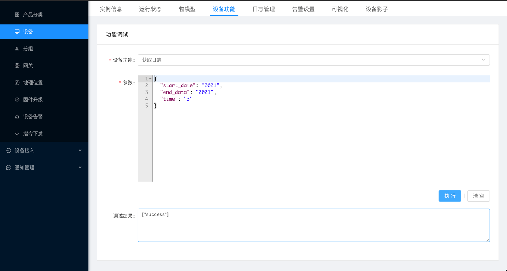