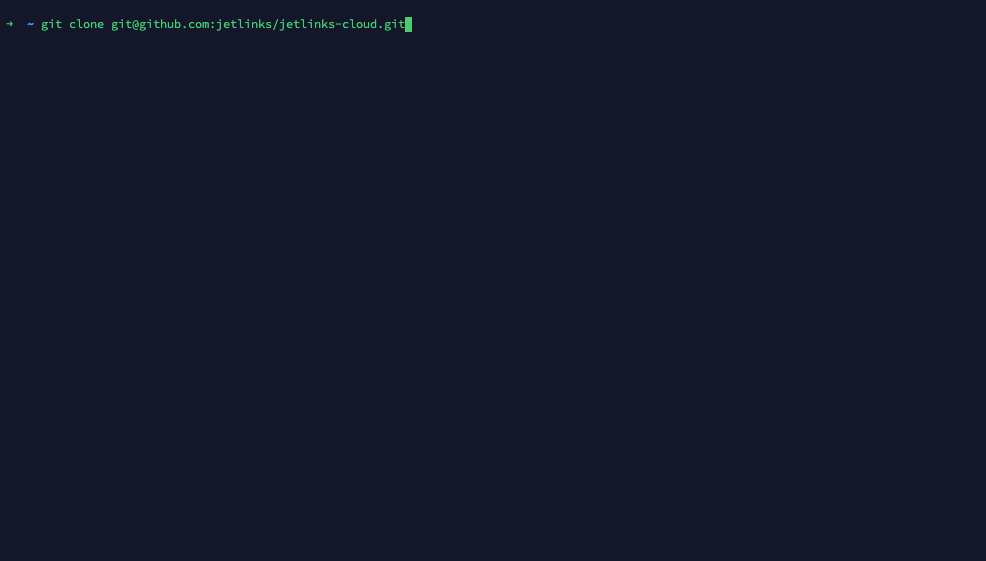
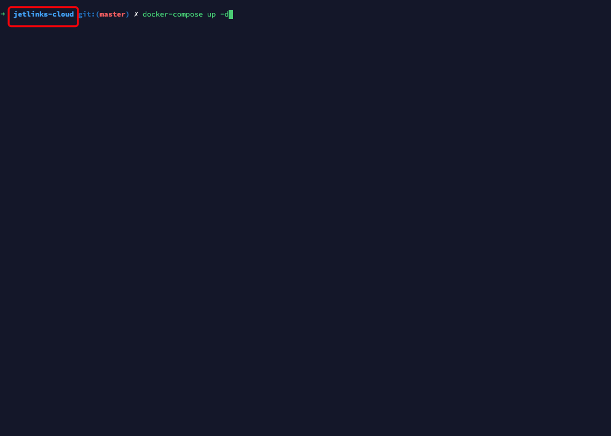
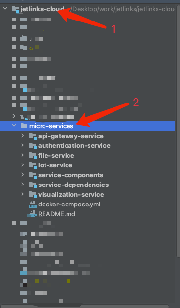
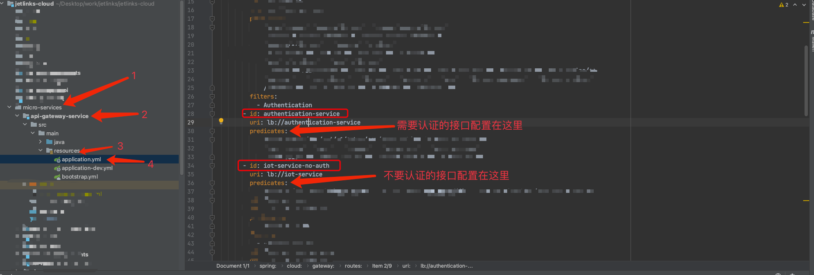

# 启动jetlink-cloud微服务版本

## 后端代码启动

### 获取代码

第一步: 先到个人设置中[添加SSH key](https://github.com/settings/keys)

第二步: 在终端输入以下命令拉取代码
```bash
 $ git clone git@github.com:jetlinks/jetlinks-cloud.git
```


第三步: 更新代码

JetLinks Pro使用`git多模块`管理,使用此命令更新全部模块.
```bash
$ git pull && git submodule init && git submodule update && git submodule foreach git checkout master && git submodule foreach git pull origin master
```

### 开发

开发之前,你应该对`java8`,`maven`,`spring-boot`,`reactor`,有一定了解.

推荐使用Idea作为集成开发环境.

推荐使用docker来快速启动完整的开发所需要的相关环境,比如:redis,postgresql,elasticsearch等.
如果无法在开发环境中使用docker. 可使用内嵌方式启动开发环境.

### docker方式启动开发环境

直接在项目目录下运行命令即可:

```bash
$ docker-compose up -d
```


### 启动服务
打开项目，启动每个服务`api-gateway-service`,`authentication-service`,`file-service`,`iot-service`,`visualization-service`即可



::: tip 注意：
如何需要添加认证的接口，可以在项目的`micro-services`文件夹中`api-gateway-service`模块下的`application.yml`下配置，不需要认证的接口也在里面配置，

如图：


:::

### docker方式启动前端
如果前端不需要改动可以输入以下命令启动前端，本地[运行前端](http://doc.jetlinks.cn/install-deployment/start-with-source.html)
```bash
$ docker run -it --rm -p 9000:80 -e "API_BASE_PATH=http://host.docker.internal:8800/" registry.cn-shenzhen.aliyuncs.com/jetlinks/jetlinks-ui-antd:1.11.0
```


